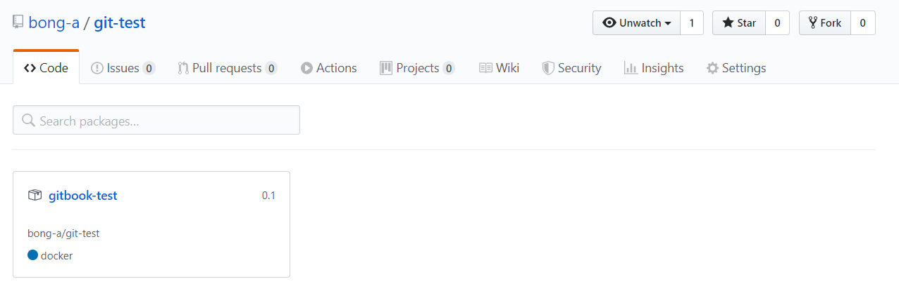

# GitHub Packages 사용하여 도커 구성하기

Created: Nov 26, 2019 10:24 PM
Created By: 봉아 임
Last Edited By: 봉아 임
Last Edited Time: Nov 26, 2019 11:19 PM
Status: In Progress 🙌

본 문서는 [https://help.github.com/en/github/managing-packages-with-github-packages/configuring-docker-for-use-with-github-packages](https://help.github.com/en/github/managing-packages-with-github-packages/configuring-docker-for-use-with-github-packages)를 기반으로 번역 또는 수정되었습니다.

GitHub Packages를 사용하여 도커 이미지 배포 및 반영하기

## Authenticating to GitHub Packages

GitHub Packages에 설치, 삭제, 배포하기 위해서는 access token이 필요하다.

GitHub Packages나 GitHub API에 인증하기 위해 개인 access token을 사용할수있다.

또는 GitHub Actions workflow를 이용하여 `GITHUB_TOKEN`을 인증하는데 사용할 수 있다.

### 개인 Access Token으로 인증하기

반드시 패키지 배포 및 설치하기 위해 개인 access token를 사용해야한다.

자세한 내용은 아래 페이지 참고 할 것

[About GitHub Packages](https://help.github.com/en/github/managing-packages-with-github-packages/about-github-packages#about-tokens)

`docker`명령어를 통해 GitHub Packages with Docker에 인증할 수 있다.

USERNAME은 당연히 사용자계정이름으로 바꿔줘야 하며, TOKEN은 개인 access token으로 바꿔줘야한다.

    $ docker login docker.pkg.github.com -u USERNAME -p TOKEN

### GITHUB_TOKEN으로 인증하기

GitHub Actions workflow를 사용한다면, GITHUB_TOKEN을 GitHub Packages에 패키지 배포하는데 사용할 수 있다. 

personal access token 관리 및 저장 필요없이 GITHUB_TOKEN만으로 접근이 가능하다.

자세한 내용은 아래 페이지 참고할 것.

[Authenticating with the GITHUB_TOKEN](https://help.github.com/en/actions/automating-your-workflow-with-github-actions/authenticating-with-the-github_token)

### Publishing a package(패키지 배포)

> 도커에서는 이미지 배포?쯤 되려나

GitHub Packages는 레포지토리당 여러 도커 이미지(상위레벨의 도커 이미지)를 지원한다.

한 레포지토리는 수 많은 이미지 태그를 가질 수 있다.

10GB이상의 도커 이미지 설치 및 배포는 느린 서비스를 유발할 수 있다. ( =너무 큰 이미지 쓰지마라)

대문자는 지원안하므로 소문자를 써야한다. 대문자가 포함되면 그냥 소문자로 바꿔서 입력하면 된다.

1. 배포할 도커 이미지 ID 확인  - docker images
2. tagging

        $ docker tag IMAGE_ID docker.pkg.github.com/OWNER/REPOSITORY/IMAGE_NAME:VERSION

    - OWNER : 사용자 이름
    - REPOSITORY : 프로젝트를 포함하고 있는 repository 이름
    - IMAGES_NAME: 패키지 또는 이미지 이름
    - VERSION : 빌드 버전 (바꿀수 없으니 신중해야한다.)

2-1. 빌드

    # Build the image with docker.pkg.github.com/OWNER/REPOSITORY/IMAGE_NAME:VERSION
    # Assumes Dockerfile resides in the current working directory (.)
    $ docker build -t docker.pkg.github.com/octocat/octo-app/monalisa:1.0 .
    
    # Push the image to GitHub Packages
    $ docker push docker.pkg.github.com/octocat/octo-app/monalisa:1.0

3. 도커 이미지 배포

    $ docker push docker.pkg.github.com/OWNER/REPOSITORY/IMAGE_NAME:VERSION 

### 패키지 설치하기(도커 이미지 가져오기)

    $ docker pull

위 명령어를 이용하여 GitHub Packages로부터 이미지 설치 가능하다.

    $ docker pull docker.pkg.github.com/OWNER/REPOSITORY/IMAGE_NAME:TAG_NAME

### 패키지 삭제

[Deleting a package](https://help.github.com/en/github/managing-packages-with-github-packages/deleting-a-package)

### 레파지토리 패키지 보기

[Viewing packages](https://help.github.com/en/github/managing-packages-with-github-packages/viewing-packages)

배포한 패키지는 해당 레포지토리 → packages에서 볼 수 있다.

뿐만 아니라 본인 계정 프로필 화면에서도 볼 수있다.

### 패키지(도커이미지) 검색하기

[Searching for packages](https://help.github.com/en/github/searching-for-information-on-github/searching-for-packages)