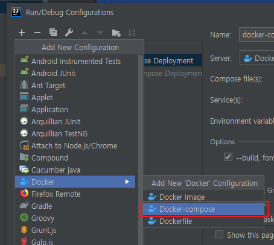
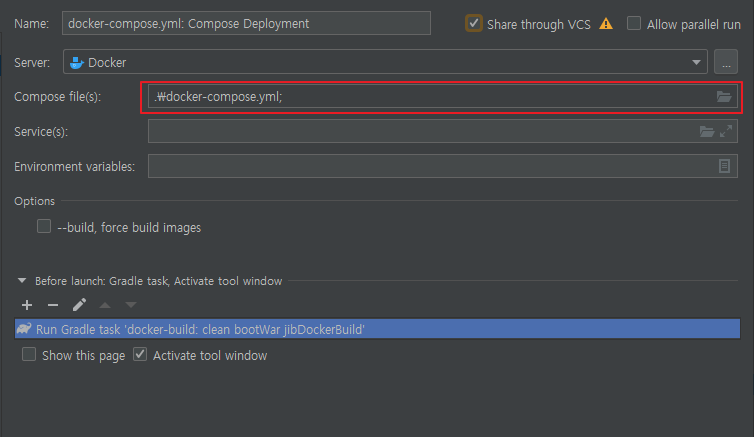
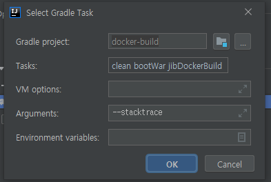
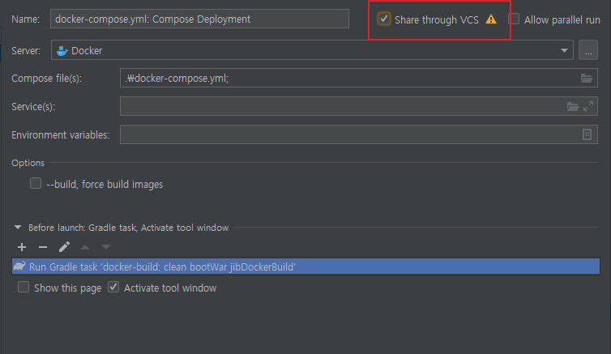

# 인텔리제이에서 도커로 배포하기

## 사전 준비

- Docker
- 스프링 프로젝트 ( [https://start.spring.io](https://start.spring.io/) )
- 메이븐이 아닌 그래들


## 도커를 위한 jib 플러그인

### 1. plugin 추가  및 설정

   ```groovy
   # build.gradle
   plugins {
   	...
   	id 'com.google.cloud.tools.jib' version '1.8.0'
   }
   ...
   
   jib {
       //default가 jetty라 tomcat으로 변경
       from.image = 'tomcat:8.5-jre8-alpine'
       container.appRoot = '/usr/local/tomcat/webapps/ROOT'
   }
   ```

### 2. docker-compose.yml 구성하기

   ```yaml
   version: "2"
   
   services:
     # 디비 사용한다는 전제하에....
     database:
       image: mariadb:10.2.20
       environment:
         MYSQL_ROOT_PASSWORD: mysql1234
         MYSQL_DATABASE: docker-test-db
         MYSQL_USER: bong
         MYSQL_PASSWORD: mysql1234
       restart: on-failure
   
     api:
       image: docker-build:0.0.1
       ports:
         - "8080:8080"
       links:
         - database
   ```

### 3. docker-compose 실행 설정

   - Run/Debug Configurations > `+`(add) 선택 > Docker > Docker-compose 선택

     

   - docker-compose 파일 경로 설정 해준다. 

     

   - Before Launch 설정 추가 > `Run Gradle Task` 선택 

     - Gradle Project : 현재 프로젝트 경로
     - Task : clean bootWar jibDockerBuild
     - Argumetns : --stacktrace

     

   - `Share through VSC` 체크시, 위에서 설정한 실행 파일을 공유하여 쓸 수 있도록 XML 파일로 만든다.

     

   ```xml
   <!-- docker_compose_yml__Compose_Deployment.xml -->
   <component name="ProjectRunConfigurationManager">
     <configuration default="false" name="docker-compose.yml: Compose Deployment" type="docker-deploy" factoryName="docker-compose.yml" server-name="Docker">
       <deployment type="docker-compose.yml">
         <settings>
           <option name="commandLineOptions" value="--build" />
           <option name="sourceFilePath" value="docker-compose.yml" />
         </settings>
       </deployment>
       <method v="2">
         <option name="Gradle.BeforeRunTask" enabled="false" tasks="clean bootWar jibDockerBuild" externalProjectPath="$PROJECT_DIR$" vmOptions="" scriptParameters="--stacktrace" />
       </method>
     </configuration>
   </component>
   ```

   - docker-compose service 실행하면 bootWar를 통해 빌드를 하고, jibDockerBuild를 통해 도커 이미지를 빌드한다. 그리고 docker-compose.yml을 통해  해당 프로젝트에 필요한 서비스들 각 컨테이너에 올려 실행시킨다.


### 참고한 글

-  https://www.bsidesoft.com/?p=7871 
-  https://github.com/GoogleContainerTools/jib/tree/master/jib-gradle-plugin 


### 다시 읽어보고 정리하면 좋을 것같은 글

-  [https://medium.com/@gaemi/spring-boot-%EA%B3%BC-docker-with-jib-657d32a6b1f0](https://medium.com/@gaemi/spring-boot-과-docker-with-jib-657d32a6b1f0) 
-  https://blog.naver.com/PostView.nhn?blogId=rpgcpstory&logNo=221316060693&redirect=Dlog&widgetTypeCall=true&directAccess=false 


### TO-DO

- [ ] jib + github packes 도커 이미지 배포 방법?