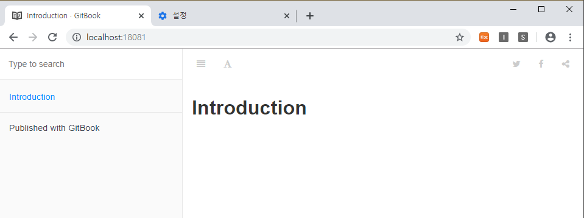
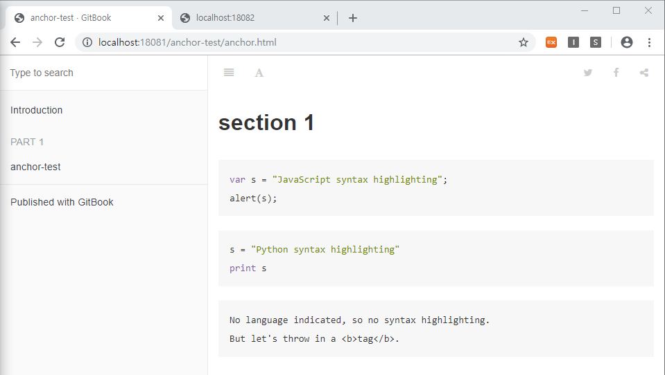

## GitBook On Docker

## GitBook 소개


## 도커에서 GitBook 실행

1. 도커 이미지 선택

   `docker search gitbook`

   gitbook으로 검색된 이미지가 나오는데 가장 많이 다운받은 순으로 봤을 때 제일 높은 이미지인 `fellah/gitbook`를 가져왔다.

   ```bash
   docker pull fellah/gitbook
   ```

   [fellah/gitbook]: https://hub.docker.com/r/fellah/gitbook	"fellah/gitbook"

2. 실행

   ```bash
   docker run -p 80:4000 -v /srv/gitbook fellah/gitbook
   ```

   - `4000` – GitBook 기본 서버 포트

   - `35729` – Live reload server port. 실시간 로드되는 서버 포트?
   -  `/srv/gitbook` – 데이터 볼륨 설정을 통해  gitbook 실행할 경로를 넘겨준다.

   ```bash
   # -d : 백그라운드에서 컨테이너 실행
   # -rm : 컨테이너 종료시 컨테이너 자동 삭제
   docker run --name gitbook --rm -d -p 18081:4000 -p 18082:35729 -v "/$PWD/gitbook-work":/srv/gitbook -it fellah/gitbook //bin/bash
   # 컨테이너 접속
   docker attach gitbook
   ```

3. 빌드(정적 웹페이지로 빌드)

   ```bash
   docker run --rm -v "/$PWD/gitbook-work":/srv/gitbook fellah/gitbook gitbook build
   ```

   

## GitHub에 GitBook 구성하기

1. gitbook 컨테이너에 접속해서 gitbook 구성하기

```bash
root@de811cc0e8f2:/srv/gitbook# gitbook init ./
root@de811cc0e8f2:/srv/gitbook# ls -lart
total 1
-rwxr-xr-x 1 root root 16 Nov 10 13:37 README.md
-rwxr-xr-x 1 root root 40 Nov 10 13:37 SUMMARY.md
drwxrwxrwx 2 root root  0 Nov 10 13:39 ..
drwxrwxrwx 2 root root  0 Nov 10 13:41 .
drwxrwxrwx 2 root root  0 Nov 10 13:41 _book
root@de811cc0e8f2:/srv/gitbook# gitbook serve
```

2.   http://localhost:18081/  접속

   

3. GitBook 구성 설명

   - SUMMARY.md 

     - 메인 챕터와 서브챕터의 구조를 정의

     - 책의 목차를 생성하는데 사용된다.

     - 파일의 형식은 간단한 링크들로만 구성되어 있다.

       ```markdown
       # Summary
       
       * [Introduction](README.md)
       ```

       - 링크의 제목 = 챕터의 제목
       - 링크의 대상 = 해당 챕터의 파일 경로

     - 앵커도 활용 가능하다.

       ```markdown
       # Summary
       
       * [Introduction](README.md)
       
       ### PART 1
       * [anchor-test](anchor-test/anchor.md#section1)
       ```

   - 페이지 작성

     ```bash
     mkdir anchor-test
     touch anchor.md
     vi anchor.md
     ```

     ```markdown
     # anchor.md
     ---
     description: 페이지의 간략설명입니다.
     ---
     
     
     # section 1
     
     ​```javascript
     var s = "JavaScript syntax highlighting";
     alert(s);
     ​```
     
     ​```python
     s = "Python syntax highlighting"
     print s
     ​```
     
     ​```
     No language indicated, so no syntax highlighting.
     But let's throw in a <b>tag</b>.
     ​```
     ```

     

     

4. 빌드 후 GitHub에 배포하기

   ```shell
   cd gitbook
   git checkout gh-pages
   
   cd ../
   docker run --rm -v "/$PWD/gitbook-work":/srv/gitbook fellah/gitbook gitbook build
   cp -rf gitbook-work/_book/* gitbook/
   
   cd gitbook
   git clean -fx node_modules
   git clean -fx _book
   
   git add .
   git commit -a -m "Update docs"
   git push origin gh-pages
   ```

   

   